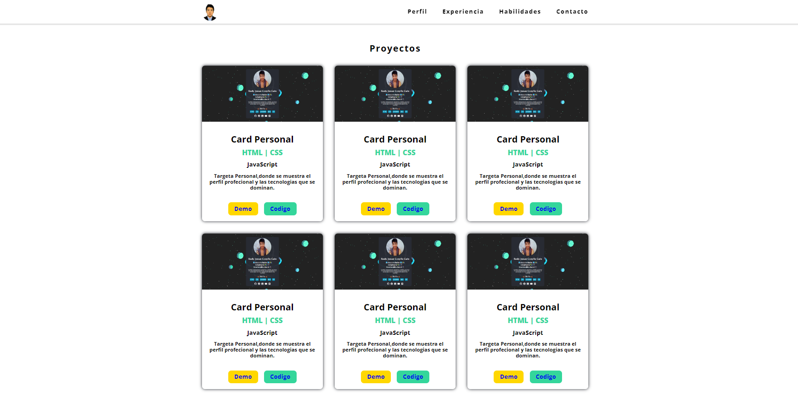
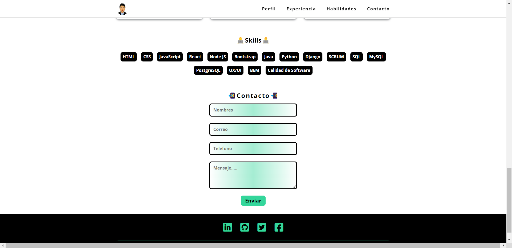
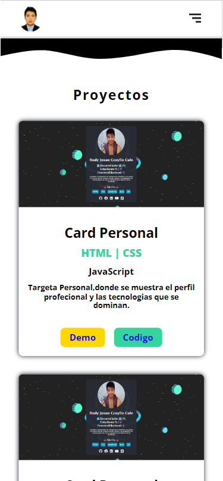
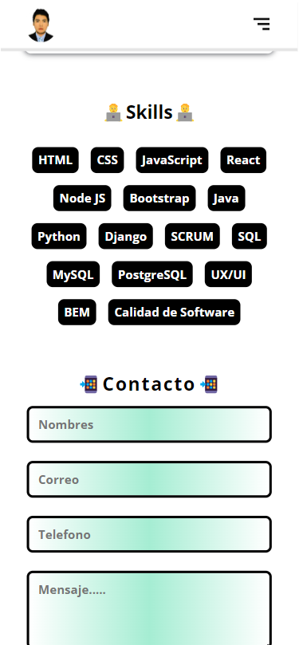

# [**Pagina Personal**](https://josuecoder.github.io/pagina-personal/)|  | 

### *Pagina Personal donde se describe el perfil profecional,habilidades y las tecnologias dominadas.*

## 👉[**Demo Pagina Personal**](https://josuecoder.github.io/pagina-personal/)

## **🧑‍💻Tecnologias Usadas🧑‍💻**

| HTML | CSS | JS | 
| --- | --- | --- |
| |  | | 

## **Desktop View**

## **Mobile View**

